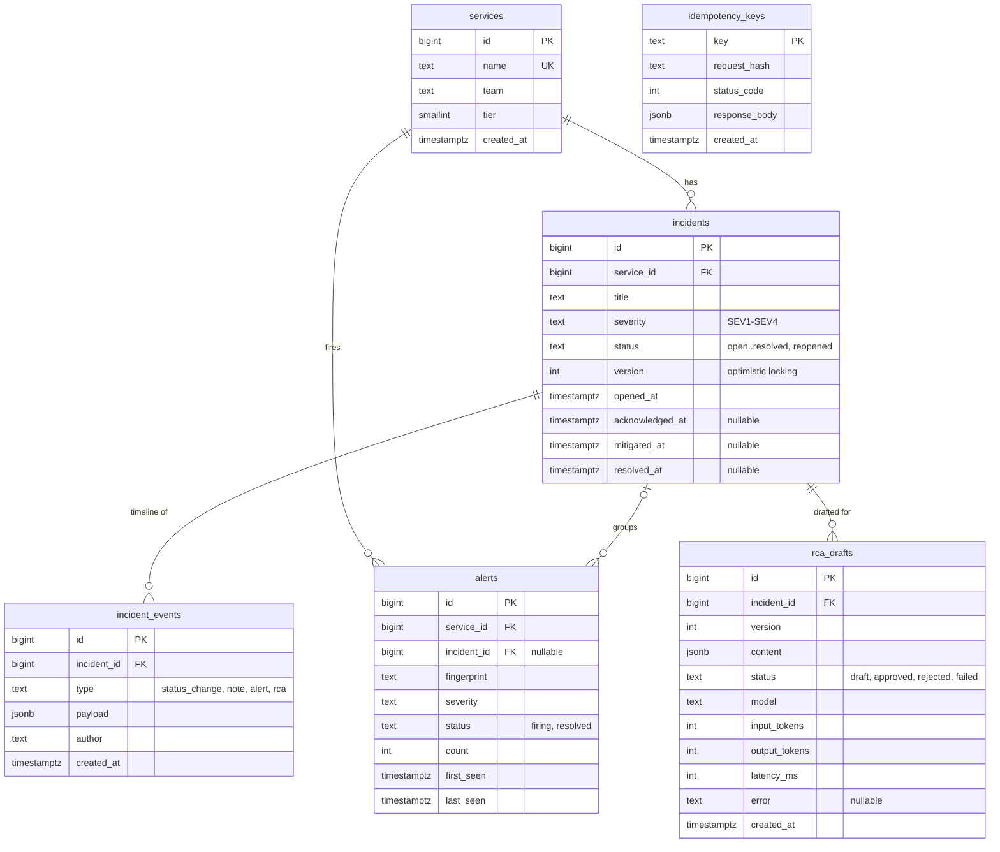

# Database design

## Event flow and why deduplication lives in the database

- **At least once:** if a monitoring tool doesn't get our `200 OK` back, it can't tell whether we saved the alert, so it sends it again. Losing an alert is worse than a duplicate, so duplicates are normal and the API must absorb them: same alert → `count + 1` and update `last_seen`, without opening a new incident.
- **Why an application check fails:** "check if it exists, then insert" leaves a gap between the two steps. Two identical requests can both check, both see "not found", and both insert. The app runs as several processes that can't see each other.
- **So the guarantee lives in the database.** It sees every insert. A partial unique index on `(service_id, fingerprint) WHERE status = 'firing'` makes a second firing copy impossible, and `INSERT … ON CONFLICT DO UPDATE` turns the duplicate into a count update.
- **Fingerprint** = what makes two alerts "the same" (service + alert name + labels, never the timestamp).

## ER diagram

## Conventions (all tables)

- **IDs:** `bigint` identity. Simple and ordered.
- **Text:** `text`. Same as `varchar` in Postgres, with no length limit to hit.
- **Times:** `timestamptz`, so stored times always carry a time zone.
- **Status / severity:** `text` + `CHECK (value IN (...))`. Easier to change later than a Postgres `ENUM`.
- **Deleting a service:** `RESTRICT` if it has incidents, so incident history is never lost.

## Tables

### services
The systems being monitored (e.g. `payment-service`). Every incident and alert belongs to one.
- `id`, `name` (unique, required), `team`, `tier`, `created_at`

### incidents
One real problem, however many alerts fired. Holds the current status and the timestamps used for MTTA/MTTR.
- `id`, `service_id` (FK → services), `title`
- `severity`: SEV1–SEV4
- `status`: open / acknowledged / investigating / mitigated / resolved / reopened, default `open`
- `version`: default 1, for optimistic locking
- `opened_at`: required, default `now()`
- `acknowledged_at`, `mitigated_at`, `resolved_at`: nullable, filled as the incident progresses

### incident_events
The timeline: every status change, note, alert and RCA event for one incident, in order.
- `id`, `incident_id` (FK → incidents)
- `type`: status_change / note / alert / rca
- `payload`: JSONB, because each event type carries different details
- `author`, `created_at`

### alerts
Raw signals from monitoring. Identical firing alerts collapse into one row with a `count`.
- `id`, `service_id` (FK → services), `incident_id` (FK → incidents, nullable)
- `fingerprint`, `severity`
- `status`: firing / resolved, default `firing`
- `count`: default 1
- `first_seen`, `last_seen`

### idempotency_keys
Remembers the response to a request so a retried request returns the same answer instead of creating something twice. Not linked to other tables.
- `key` (PK), `request_hash`, `status_code`, `response_body` (JSONB), `created_at`

### rca_drafts
AI-written RCAs awaiting human review. Edits create a new version; model, tokens and latency are stored per draft.
- `id`, `incident_id` (FK → incidents), `version`
- `content`: JSONB
- `status`: draft / approved / rejected / failed
- `model`, `input_tokens`, `output_tokens`, `latency_ms`, `error` (nullable)
- `created_at`

## Indexes

- `incidents (service_id, opened_at)` — list a service's incidents by time; MTTR per service.
- `incidents (status)` — find open / unresolved incidents quickly.
- `incident_events (incident_id, created_at)` — show one incident's timeline in order.
- `alerts (service_id, fingerprint) UNIQUE WHERE status = 'firing'` — deduplication: only one firing alert per fingerprint per service.
- `services (name) UNIQUE` — no two services with the same name; look up a service by name.
- `rca_drafts (incident_id, version) UNIQUE` — no duplicate version numbers for one incident's drafts.
- Primary keys (`id`, `idempotency_keys.key`) are indexed automatically by Postgres.
